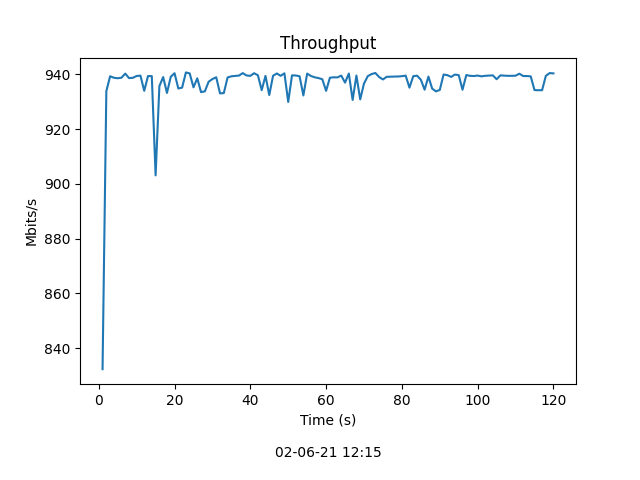
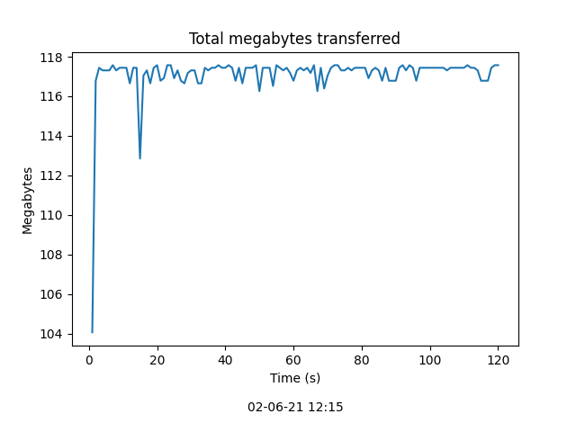

# iPerf3 plotter
Python script that plots iPerf3's JSON file

# Install
Matplot is required to run this script

```
pip install matplot
```

# Usage
Sample output is provided (sample.json) to plot it run:

```
python3 iperf_plotter.py sample.json
```

# Results
Two graphs will be generated, one with the throughput along the time, and other with the number of Megabytes sent.

## Throughput

log_throughput
## Total bytes

